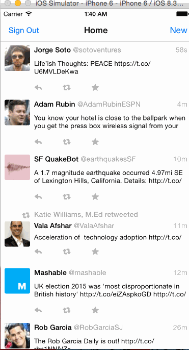

# codepath-04-twitterredux

This is a basic twitter app to read and compose tweets the [Twitter API](https://apps.twitter.com/).

## Twitter App Data

- [CheepApp](https://apps.twitter.com/app/8326819)

- Consumer Key (API Key)
  UD6Yfue3doPq9LWahObqzeZqK

- Consumer Secret (API Secret)
  IcBd7tT8tgT0aCl3ROuxWbzKr8I6Zsa0jvqz5gjYMLU6WLV5Oa

- Owner
  davidkuchar

- Owner ID
  23178363

Time spent: `7:49`

### Features

## TODO

3. wire up mentions view
4. wire up profile view
5. fix constraints
6. fix profile image fills

#### Required

- [x] Hamburger menu: Dragging anywhere in the view should reveal the menu.
- [x] Hamburger menu: The menu should include links to your profile, the home timeline, and the mentions view.
- [x] Hamburger menu: The menu can look similar to the LinkedIn menu below or feel free to take liberty with the UI.
- [x] Profile page: Contains the user header view
- [x] Profile page: Contains a section with the users basic stats: # tweets, # following, # followers
- [x] Home Timeline: Tapping on a user image should bring up that user's profile page

#### Optional

- [ ] Profile page: Implement the paging view for the user description.
- [ ] Profile page: As the paging view moves, increase the opacity of the background screen. See the actual Twitter app for this effect
- [ ] Profile page: Pulling down the profile page should blur and resize the header image.
- [ ] Account switching: Long press on tab bar to bring up Account view with animation
- [ ] Account switching: Tap account to switch to
- [ ] Account switching: Include a plus button to Add an Account
- [ ] Account switching: Swipe to delete an account

### Walkthrough

GIF created with [LiceCap](http://www.cockos.com/licecap/).
